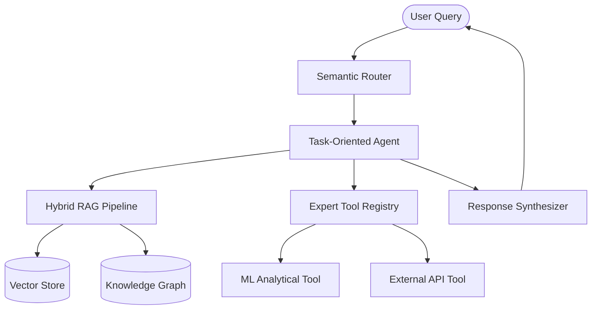

# Advanced Conversational AI Orchestrator

[](#)
[](#)
[](#)

An enterprise-grade, research-oriented Conversational AI Framework designed for high-stakes NLP leadership and complex ML orchestration.

## 🏗️ Technical Architecture

The orchestrator utilizes a multi-layered approach to handle complex conversational workflows:



## 🧠 Core Capabilities

### 1. Agentic Workflow Management
Implements advanced **Reason + Act (ReAct)** loops to decompose multi-step queries. The agent autonomously selects tools and evaluates its own progress towards a solution.

### 2. Hybrid Retrieval Augmented Generation (RAG)
Combines dense vector embeddings with sparse keyword search and **Knowledge Graph** traversal to provide contextually rich and factually accurate responses.

### 3. Scalable ML Pipelines
Modular design allowing for the seamless integration of custom ML models (e.g., Sentiment Analysis, Intent Classification) into the conversational loop.

### 4. Enterprise Observability
Built-in evaluation metrics for **Faithfulness**, **Answer Relevance**, and **Context Precision**, inspired by the RAGAS framework.

## 🚀 Professional Setup

### Installation
```bash
git clone https://github.com/MarkTangggg/Conversational-AI-NLP-Leader.git
cd Conversational-AI-NLP-Leader
pip install -r requirements.txt
```

### Quick Start
```python
from src.core.orchestrator import AIOrchestrator

orchestrator = AIOrchestrator(config_path="config/enterprise_config.yaml")
response = orchestrator.process_query("How can we optimize our current NLP pipeline for high-throughput?")
print(response)
```

## 🧪 Technical Deep Dive
For detailed information on the retrieval strategies and agentic logic, please refer to the `docs/` directory.

---
*Architected and Led by Mark Tang.*
